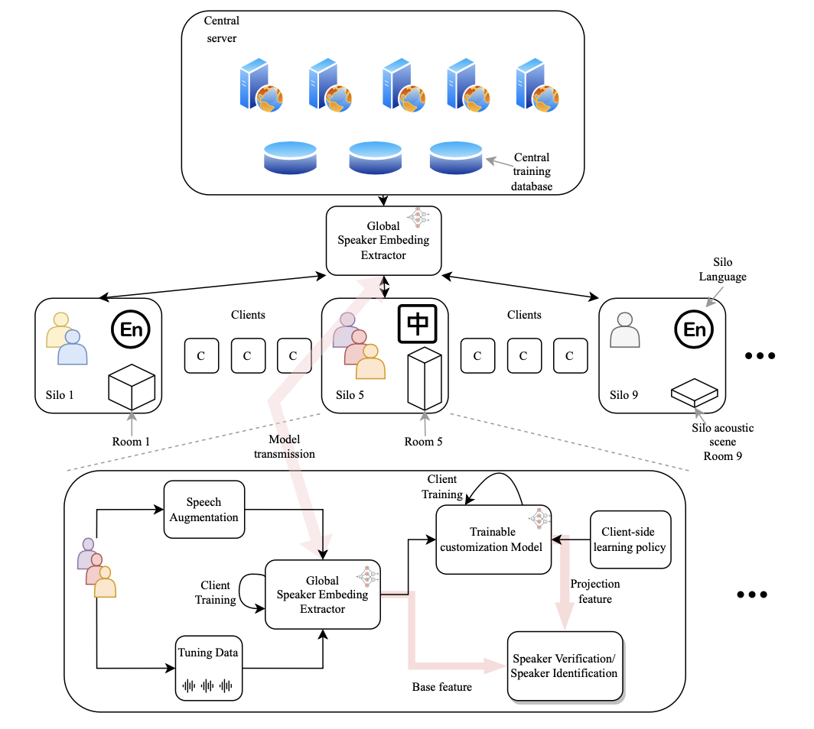

# FedSPK: Speaker Recognition with Federated Learning

This repository contains the implementation of our paper **Learning Domain-Heterogeneous Speaker Recognition Systems with Personalized Continual Federated Learning**. The project aims to develop a speaker recognition system that leverages federated learning to handle domain heterogeneity and provides personalized continual learning for robust and adaptive performance.

## Table of Contents
- [Overview](#overview)
- [Features](#features)
- [Installation](#installation)
- [Usage](#usage)
- [Dataset](#dataset)
- [License](#license)
- [Acknowledgments](#acknowledgments)

## Overview

FedSPK is designed to address challenges in speaker recognition by utilizing federated learning techniques that support personalization and continual learning. This approach enables the system to adapt to different domains without centralizing data, thus ensuring data privacy.

## Features
- **Federated Learning**: Distributed training without data centralization.
- **Continual Learning**: Incremental learning capabilities to adapt to new domains.
- **Personalized Models**: Each client can have a customized model based on specific needs.
- **Domain Adaptability**: Capable of handling heterogeneous data across different domains.

## Installation
To set up the environment, clone this repository and install the required packages.

```bash
git clone https://github.com/your-username/FedSPK.git
cd FedSPK
pip install -r requirements.txt
pip install pyroomacoustics
```
## Usage
After setting up the environment, you can start training the speaker recognition model with federated learning by running:

```bash
python main.py
```
## Dataset
FedSPK requires a dataset of Voxceleb. Ensure your dataset is properly formatted and accessible. You may need to download or preprocess a dataset as outlined in the data/ directory or repository documentation. Process using create_dataset.ipynb

## License
This project is licensed under the MIT License. See the LICENSE file for more details.

## Acknowledgments
We would like to acknowledge and thank the authors of our paper *Learning Domain-Heterogeneous Speaker Recognition Systems with Personalized Continual Federated Learning*. If you reference or build upon this work, please cite our original paper as follows:

```bash
@article{chen2023domainheterogeneous, title={Learning domain-heterogeneous speaker recognition systems with personalized continual federated learning}, author={Chen, Zhiyong and Xu, Shugong}, journal={EURASIP Journal on Audio, Speech, and Music Processing}, volume={2023}, number={1}, pages={33}, year={2023}, publisher={Springer} }
```


